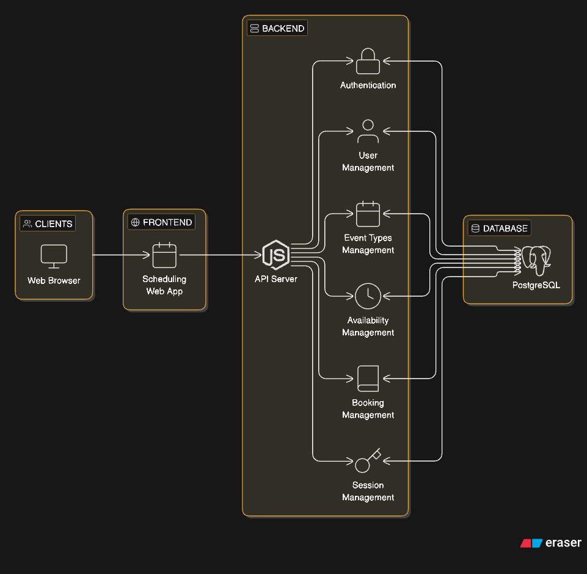

# Cal.com (Node.js + PostgreSQL + React)

## Problem Statement
Build a Cal.com-style scheduling app with authenticated hosts, public booking, and hard guarantees against double‑booking.

## System Architecture


## Core Features Implemented
1. Event Types Management
   - Create, edit, delete event types with title, description, duration, and URL slug
   - List all event types on the dashboard
   - Each event type has a unique public booking link
2. Availability Settings
   - Weekly day toggles and time slots per day
   - Multiple slots per day with 15‑minute increments
3. Public Booking Page
   - Calendar view + available dates
   - Time slots generated from availability and event duration
   - Booking form (name + email)
   - Double‑booking prevented
   - Booking confirmation page with event details
4. Bookings Dashboard
   - Upcoming, past, cancelled scopes
   - Cancel a booking

## Additional Features
- Email/password auth with server‑side sessions
- Open signup + auto‑login
- Per‑user admin data (event types, availability, bookings)
- Host self‑booking is blocked

## Key Guarantees / Edge Cases
- **Double‑booking** blocked at DB level using a GIST exclusion constraint (prevents race conditions).
- **Per‑user slugs**: duplicate event titles are allowed across different users, but not for the same user.
- **Handle‑based URLs**: public links use `/{handle}/{eventSlug}` so they’re globally unique.
- **Host self‑booking** returns `403 HOST_BOOKING_NOT_ALLOWED`.
- **Availability rules** validated for overlaps and 15‑minute boundaries.
- **UTC storage** for bookings; display converts to host/guest timezone.
- **Slot boundaries** are `[start, end)` to allow back‑to‑back meetings.

## Tech Stack
- Node.js + Express
- PostgreSQL + Prisma
- Luxon (timezones)
- React + Vite
- Vitest + Supertest (API tests)

## User Journey
1. Host signs up → auto‑logged in.
2. Host configures availability and creates event types.
3. Host shares public booking link.
4. Guest selects date/time → enters details → booking confirmed.
5. Host cannot book their own event type.

## Local Setup
### Backend + DB
```bash
npm install
cp .env.example .env
npm run prisma:generate
npm run prisma:migrate
```

Optional seed (creates a default host, sample event types, availability, bookings):
```bash
npm run prisma:seed
```

Start API:
```bash
npm run dev:api
```

### Frontend
```bash
npm --prefix web install
npm run dev:web
```

### URLs
- Admin UI: `http://localhost:5173/event-types`
- Signup: `http://localhost:5173/signup`
- Public booking: `http://localhost:5173/<handle>/<eventSlug>`

## Environment Variables
`.env.example` includes:
- `DATABASE_URL`
- `PORT`
- `DEFAULT_HOST_EMAIL`
- `DEFAULT_HOST_PASSWORD` (used by seed, default `password123`)
- `SESSION_DAYS` (default 7)

## API Overview (Core)
Auth:
- `POST /api/auth/signup`
- `POST /api/auth/login`
- `POST /api/auth/logout`
- `GET /api/auth/me`

Admin (auth required):
- Event types CRUD + active toggle
- Availability schedules CRUD
- Bookings list + cancel

Public:
- `GET /api/public/:handle/:slug`
- `GET /api/public/:handle/:slug/calendar?month=YYYY-MM&tz=...`
- `GET /api/public/:handle/:slug/slots?date=YYYY-MM-DD&tz=...`
- `POST /api/public/:handle/:slug/bookings`
- `GET /api/public/:handle/:slug/bookings/:id`
- `POST /api/public/:handle/:slug/bookings/:id/cancel`

## Tests
```bash
npm test
```

## Assumptions
- Open signup (no invite flow).
- Public booking is available to guests; admin is always authenticated.
- Additional booking notes are UI‑only (not stored).
